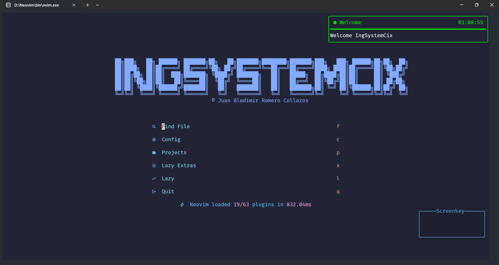

# IngSystemCix-Nvim



## Installation

### Install Nerd Fonts

1. You need to install NeoVim for Windows, you can download it from [here](https://neovim.io/).
2. To install Nerd Fonts, follow these steps:
   1. Visit the [official Nerd Fonts website](https://www.nerdfonts.com/).
   2. Download the font of your choice.
   3. Extract the downloaded file.
   4. Install the font on your operating system.

#### Instructions by Operating System

- **Windows**:
  - Right-click on the font file and select "Install".
- **macOS**:
  - Double-click on the font file and then click "Install Font".
- **Linux**:
  - Copy the font files to the `~/.local/share/fonts` directory and run `fc-cache -fv` in the terminal.

Once the font is installed, make sure to configure your terminal to use it.

### Configuration for Windows Users

We need to go to the following path to configure PowerShell. Replace `${username}` with your username:

`C:\Users\${username}\AppData\Local\Packages\Microsoft.WindowsTerminal_8wekyb3d8bbwe\LocalState\settings.json`

```json
{
  "actions": [
    {
      "keys": "ctrl+space",
      "command": {
        "action": "sendInput",
        "input": "\u001b[32;5u"
      }
    }
  ]
}
```
